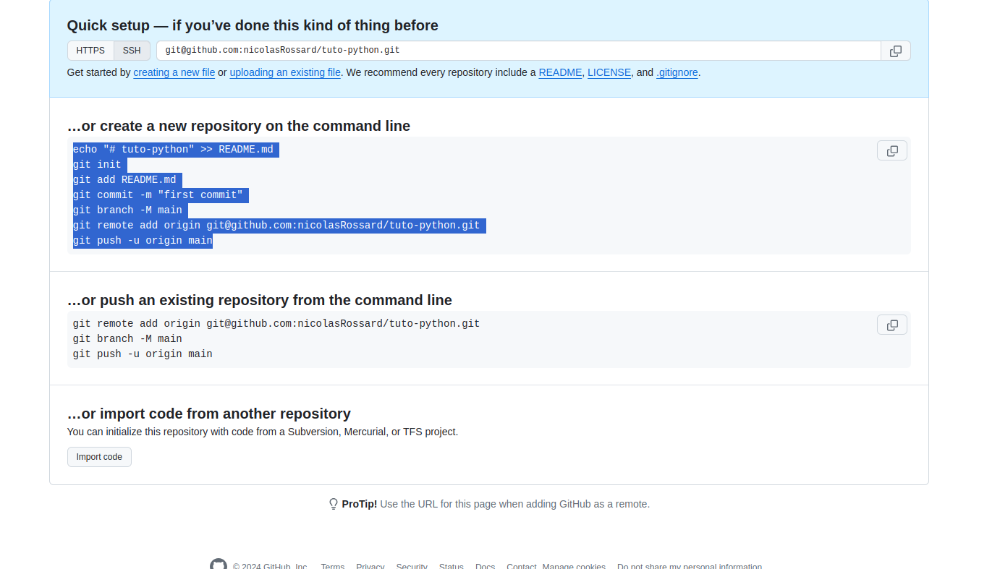

# Git

# Start new project



```shell
echo "# tuto-python" >> README.md
git init
git add README.md
git commit -m "first commit"
git branch -M main
git remote add origin git@github.com:nicolasRossard/tuto-python.git
git push -u origin main
```


# Configure SSH mode

[Explanation](https://docs.github.com/en/authentication/connecting-to-github-with-ssh/generating-a-new-ssh-key-and-adding-it-to-the-ssh-agent)

+: 
* Don't need to connect each time
* Link your git to your computer