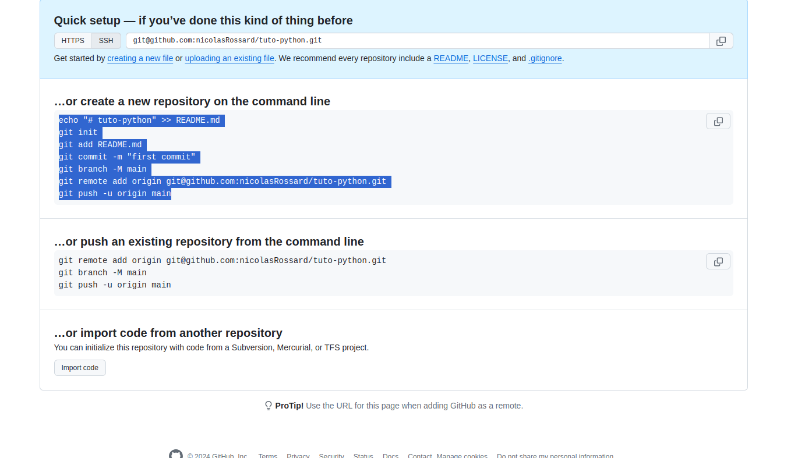

# Git

# Start new project



```shell
echo "# tuto-python" >> README.md
git init
git add README.md
git commit -m "first commit"
git branch -M main
git remote add origin git@github.com:nicolasRossard/tuto-python.git
git push -u origin main
```

# Useful files:
* README.md : Documentation of the project
* .git : all details of your git conf
* .gitignore : allows to ignore some files or folders

# Configure SSH mode
[Explanation](https://docs.github.com/en/authentication/connecting-to-github-with-ssh/generating-a-new-ssh-key-and-adding-it-to-the-ssh-agent)

+: 
* Don't need to connect each time
* Link your git to your computer


# Good practices :
* Clone project and select main branch
* Create a branch
* Create a Merge request for your branch into your main branch
* Code review : check your modification
* Merge :punch:

# Useful commands
* Start new branch
```shell
git checkout -b {branch name}
```

* Go to a remote branch
```shell
git checkout {remote branch name}
```

* Check modified files
```shell
git status
```

* Push code
```shell
git diff {file_name}
git add {file_name}
git commit -m "{your message}"
git push origin {your remote branch}
```
__OBS__ : Avoid "git add ." 

